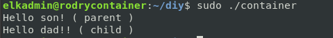
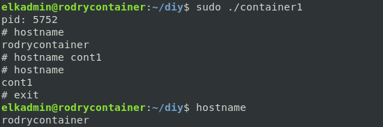
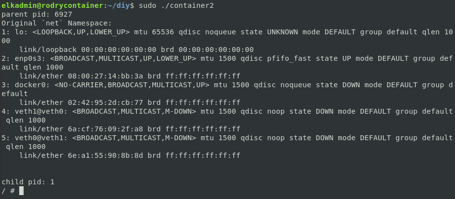

# Creating Your Own Container

## Objetive

The objetive of this lab is to create our own container, this will be done using a `C` program, review the technology and concepts to implement in a proper way processes isolation in Linux. 

## Creating a process

To create a new process we are going to create a new process and execute another one inside, in this way we can keep the control of the process. The process will be called `rod`
```
             +----------+  
             | parent   |
             |----------|
      -----  | main()   |
      |      |----------|
      |      | rod()    |  
      |      +----------+
      v 
  +--------+             +--------+
  | parent |             |  copy  |
  |--------|             |--------|
  | main() |  clone -->  | rod()  |
  |--------|             +--------+                     
  | rod()  |              
  +--------+       
``` 
As we are using `C` and `clone` is a system call we will compile it using:

```gcc -o pid -w pid.c```

Using `sudo` priviledge to execute the binary.

## Creating a child process

To create the child process we will invoke the system call using the clone system call.

To perform `clone` we will provide some memory for the new process to run, creating a function to allocate 65536 bytes. Many modern CPUs allow a memory page size of 64KiB:

```
int rod(void *args) {
  printf("Hello !! ( child ) \n");
  return EXIT_SUCCESS;
}

int main(int argc, char** argv) {
  printf("Hello, World! ( parent ) \n");

  clone(rod, stack_memory(), SIGCHLD, 0);
  wait(nullptr);
  return EXIT_SUCCESS;
}
```



We will load a shell program to test what is inside the container. To do this we will ue the funtion execvp, which will replace the current process (child) with a instance of the program.

The shell program will be wrap into the funtion int `run(const char *name)`

```
void ROD(int status, const char *msg) {
 if(status == -1) {
    perror(msg);
    exit(EXIT_FAILURE);
 }
}

char* stack_memory() {
  const int stackSize = 65536; //providing memory for new process
  auto *stack = new (std::nothrow) char[stackSize];

  if (stack == nullptr) { 
    printf("Cannot allocate memory \n");
    exit(EXIT_FAILURE);
  }  

  return stack+stackSize;
}

int run(const char *name) {
  char *_args[] = {(char *)name, (char *)0 };
  execvp(name, _args);
}

template <typename... P>
int run(P... params) {
  char *args[] = {(char *)params..., (char *)0};
  return execvp(args[0], args);
}

int rod(void *args) {
  run("/bin/sh"); // load the shell process.

  return EXIT_SUCCESS;
}

int main(int argc, char** argv) {
  ROD( clone(rod, stack_memory(), SIGCHLD, 0), "clone" );

  printf("parent pid: %d\n", getpid());
  wait(nullptr);
  return EXIT_SUCCESS;
}

```


However, to isolate the `sh` process we need to run it by clearing the environment variables.

## Isolate it using namespaces

By now the program can mess with other programs, for example network file sharing services. This will be solved using VM but it will takes to much time, instead this problem will be solved by Namespaces.

```
                Linux Kernel
 +-----------------------------------------------+

    Global Namespace's { UTS, PID, MOUNTS ... }
 +-----------------------------------------------+

         parent                   child process        
  +-------------------+            +---------+       
  |                   |            |         |
  | childEntryPoint() | clone -->  | /bin/sh |   
  |                   |            |         |
  +-------------------+            +---------+
```
  
The new process will be isolated with the CLONE_NEWPID, identified with only this pid. A process which is isolated from the other process will have its own pid to be `1`.

```
int main(int argc, char** argv) {
  ROD( clone(rod, stack_memory(), CLONE_NEWUTS | CLONE_NEWPID | SIGCHLD, 0), "clone" );

  printf("parent pid: %d\n", getpid());
  wait(nullptr);
  return EXIT_SUCCESS;
```
- CLONE_NEWUTS permit the container to have his own hostname.



- CLONE_NEWUSER enable the container to manage `user` and `group`. 

- CLONE_NEWNET, is used for Networking, allowing the container just to look it's own network designed interface (loopback).

- Below is showing the network interface for the child process, parent `PID` adn child `PID`.



- Parent and child process will manage thier own network interfaces, but this task will be created with a pair of virtual Ethernet connections executing: 

```
ip link add name veth0 type veth peer name veth1 netns <pid>
```
- Where `veth0` device is for the parent namespace and `veth1` device for the child namespace device.

```
static int child_fn() {
  printf("New `net` Namespace:\n");
  system("ip link");
  printf("\n\n");
  return 0;
}

```
## Create mountpoint


## Benchmark [ Your container, host machine, LXC, Docker ]

- I benchmarked on cpu, memory, fileio, threading using the following commands respectively:

sysbench --test=cpu --cpu-max-prime=2000000 --num-threads=120 run

sysbench --test=memory --num-threads=140 --memory-total-size=10G run

sysbench --num-threads=16 --test=fileio --file-total-size=10G 
--file-test-mode=rndrw prepare

sysbench --test=threads --thread-locks=10 --max-time=60 run

sysbench --num-threads=16 --test=fileio --file-total-size=10G --file-test-mode=rndrw cleanup 

- See benchmark report document for details of the benchmark.

- Also for testing process, especially for conatiner, we need to place the different benchmark commands in the system function system("Benchmark commands here"), and run.The different commands can be found in the document report. or the one provided above.
References
